# UML Diagrams for InterviewMate.ai
## System Architecture and Design

**Document Version:** 1.0
**Date:** December 10, 2024
**Project:** InterviewMate.ai

---

## 1. System Architecture Diagram

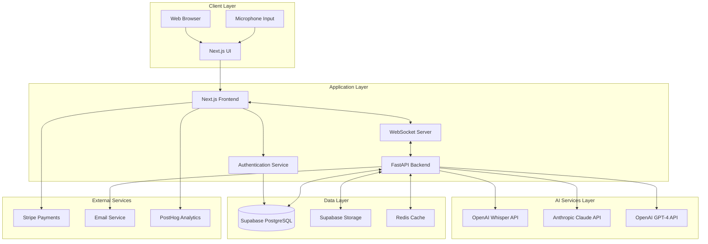

---

## 2. Component Diagram

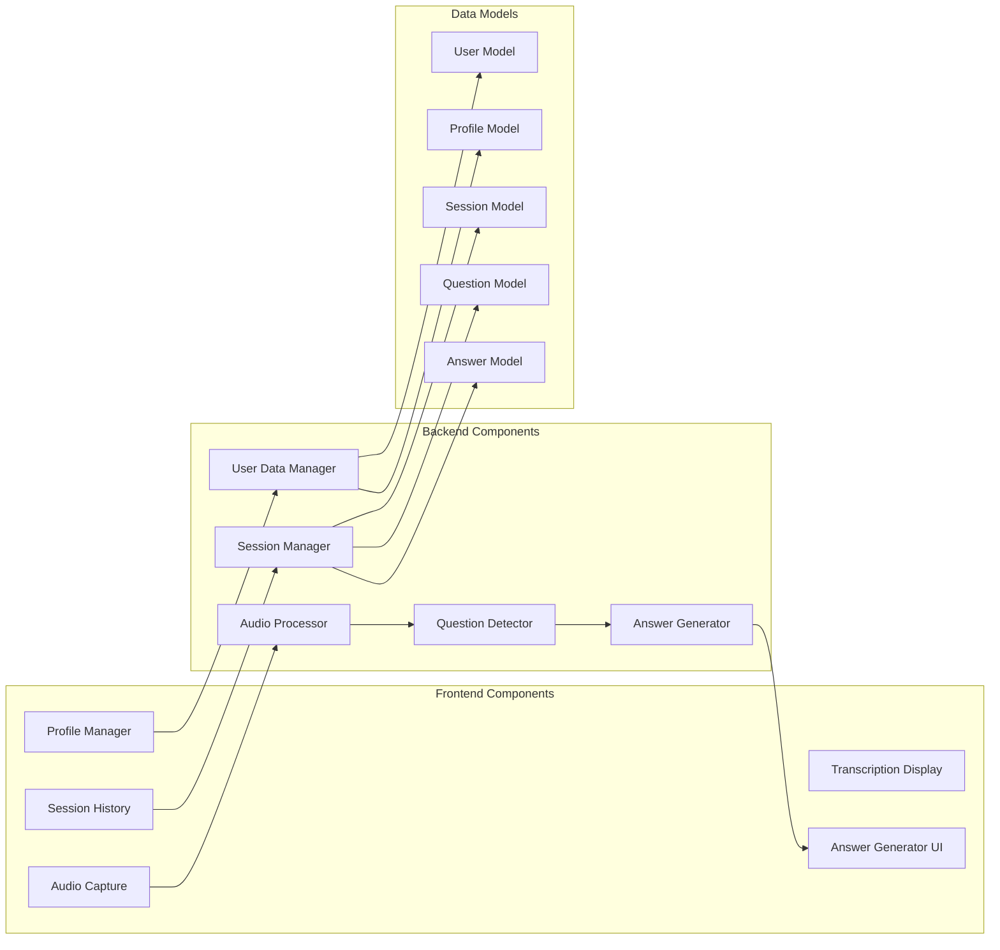

---

## 3. Class Diagram

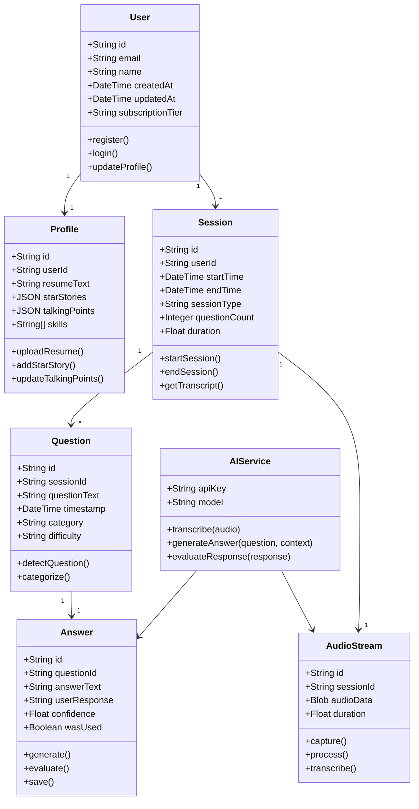

---

## 4. Sequence Diagram - Real-time Interview Practice

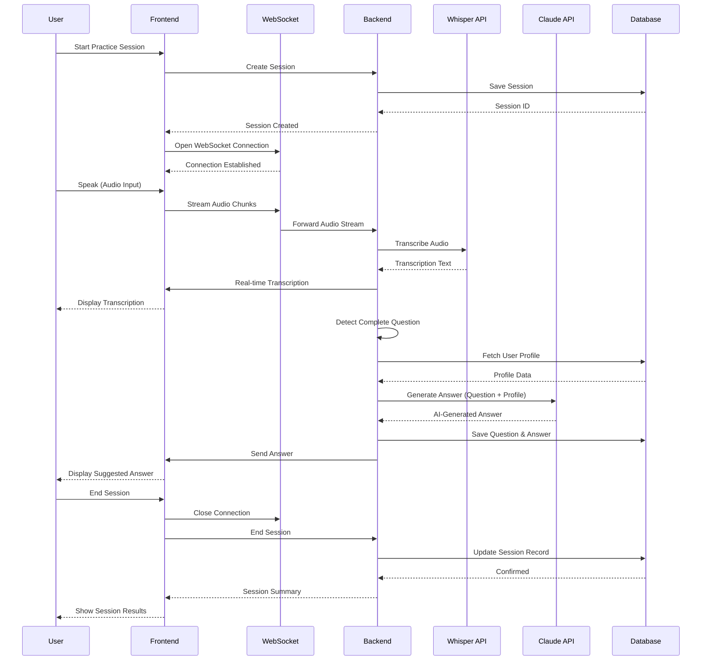

---

## 5. State Diagram - Session Lifecycle

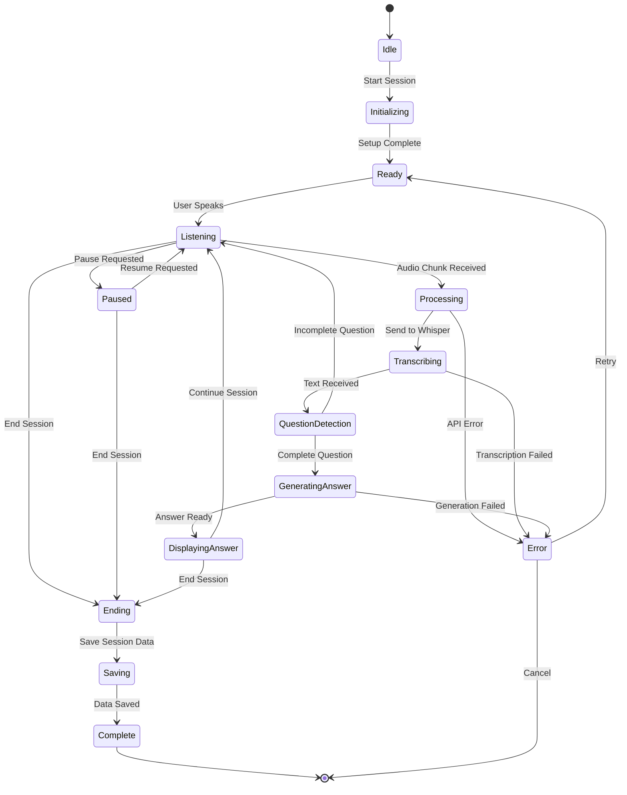

---

## 6. Use Case Diagram

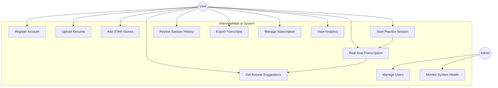

---

## 7. Data Flow Diagram

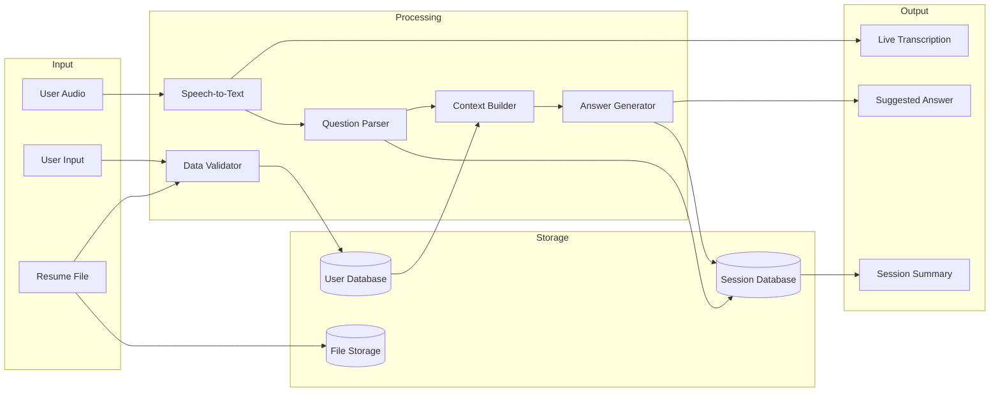

---

## 8. Deployment Diagram

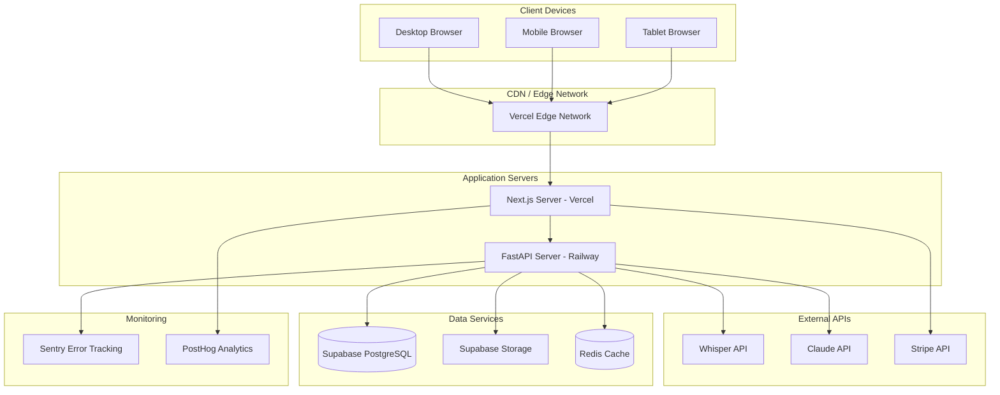

---

## 9. Entity Relationship Diagram (ERD)

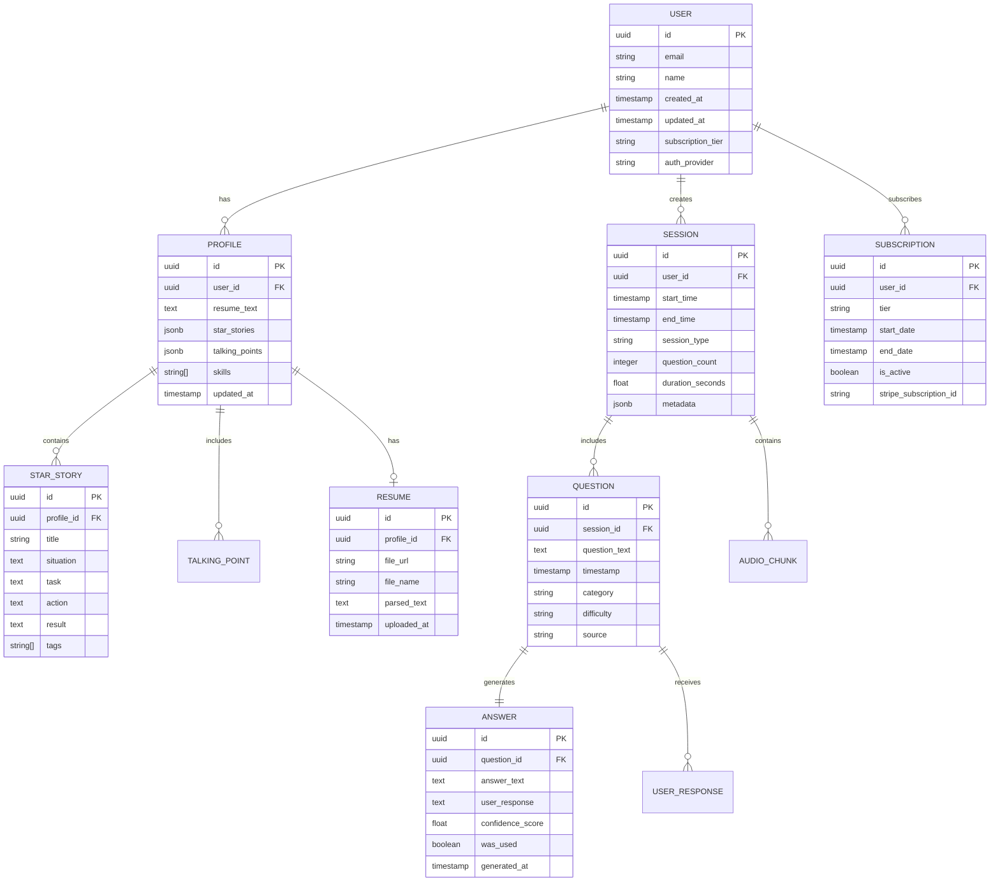

---

## 10. Activity Diagram - Complete User Journey

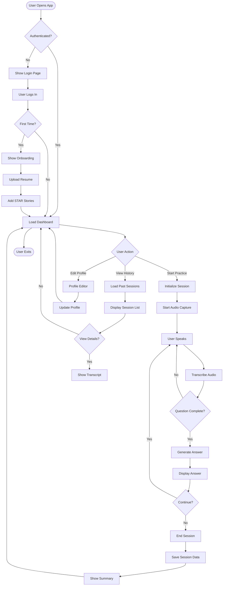

---

## 11. System Context Diagram

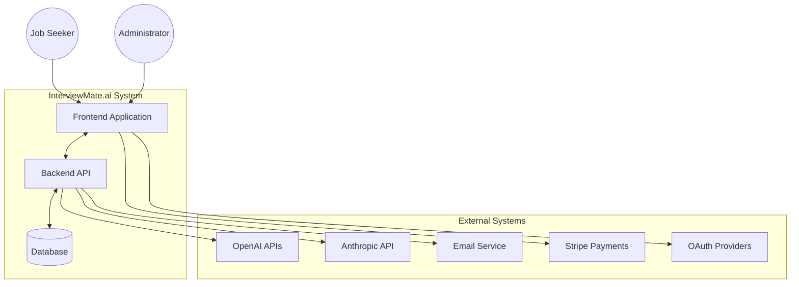

---

## 12. Microphone to Answer Flow Diagram

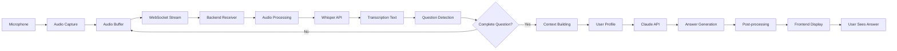

---

## 13. Security Architecture

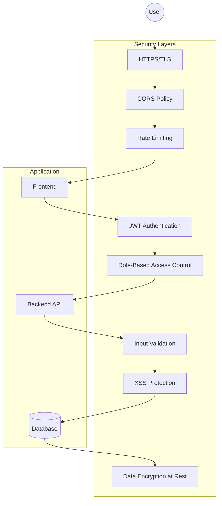

---

## Document Metadata

**Created:** December 10, 2024
**Version:** 1.0
**Author:** Heejin Jo
**Status:** Approved for Development
**Next Review:** Post-MVP Launch

---

## Notes

1. All diagrams use Mermaid syntax for easy rendering in Markdown viewers
2. Diagrams can be updated as system evolves
3. High-level diagrams focus on core functionality (MVP scope)
4. Detailed diagrams can be expanded in Phase 2 and beyond
5. Security architecture prioritizes user data protection and API key safety
